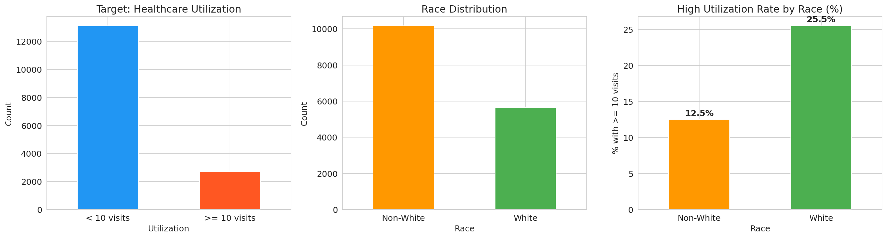
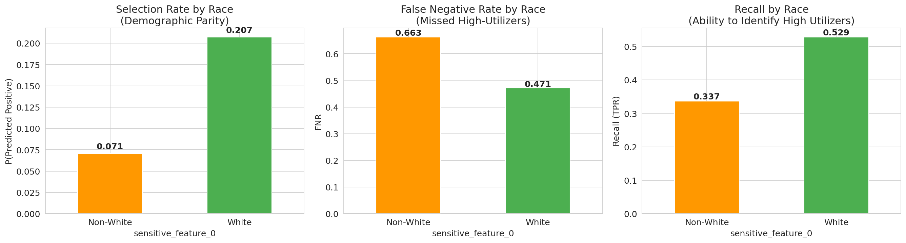
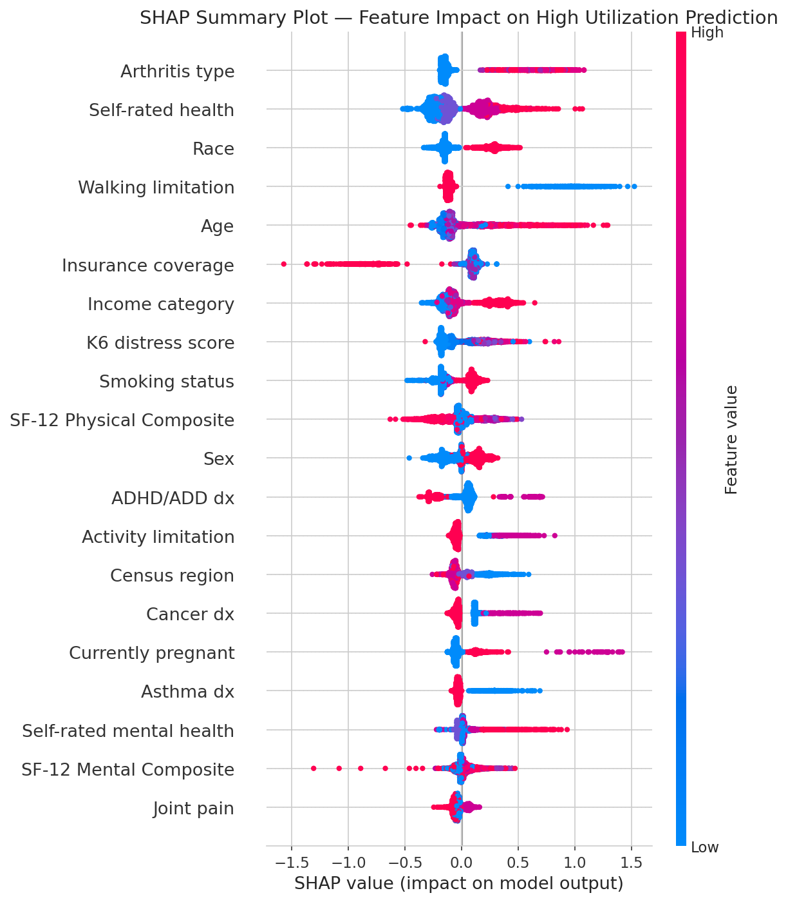
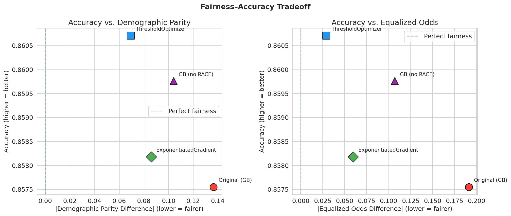

# Auditing Racial Bias in Healthcare Utilization Prediction

A technical AI ethics audit on a Gradient Boosting model that predicts high
healthcare utilization on the **MEPS Panel 19 (2015)** dataset, evaluated against
the **SDAIA AI Ethics Principles** (May 2025, SDAIA-P114E v1).

Course project for **CSC 594 — Ethical Issues in Artificial Intelligence**,
King Saud University, College of Computer and Information Sciences. Author:
Bady Ammar (ID 446910609). Instructor: Dr. Mejdl Sultan M. Safran.

## What this project does

We act as an "ethics auditor" on a Gradient Boosting classifier that predicts
whether a patient will be a high healthcare utilizer (≥10 visits/year) on the
US Medical Expenditure Panel Survey (MEPS) Panel 19. The audit:

1. **Detects bias** with Fairlearn (`MetricFrame`, Demographic Parity, Equalized
   Odds, base-rate amplification analysis).
2. **Explains** the model with SHAP (`TreeExplainer` global summary + dependence
   + individual force plots).
3. **Empirically tests** the proxy-discrimination hypothesis with a drop-`Race`
   ablation.
4. **Mitigates** the discovered bias with three interventions and characterises
   the Fairness–Accuracy trade-off:
   - GB without `Race` (cheap, partial mitigation)
   - `ThresholdOptimizer` (post-processing, `predict_proba` thresholds, EO-targeted)
   - `ExponentiatedGradient` (in-processing, GB backbone, EO-targeted)

**Headline finding.** On this dataset `ThresholdOptimizer` Pareto-dominates the
other interventions: highest accuracy (0.8607, +0.32 pts vs the unmitigated
baseline), lowest DP (0.0693, −49%), and lowest EO (0.0293, −85%). The audit
operationalises four of the seven SDAIA principles — *Fairness* and
*Transparency & Explainability* directly, plus the *Safety* dimension of
*Reliability & Safety* and the *human-oversight* requirement of
*Accountability & Responsibility*.

## Highlights — at a glance

**The bias.** White patients in the MEPS Panel 19 ground truth are high-utilizers
at 24.4%, Non-White patients at 13.1% — a 1.86× ratio. The unmitigated model
*amplifies* that ratio to 2.93× — a +57% amplification of an already-disparate
base rate.



*Target distribution (left), race distribution (centre), and ground-truth
high-utilization rate by race (right). The right panel is the audit's central
observable.*

**The audit metrics.** Selection rate, FNR, and recall are markedly different
across groups. The model flags White patients for high utilization ~3× as often
as Non-White, and **misses 66.3% of actually-high Non-White patients** versus
47.1% of White — the patient-safety harm.



*Selection rate (left), FNR (centre), and recall (right) by `Race`.*

**The mechanism (SHAP).** `Race` ranks third in mean SHAP magnitude, but two
proxies (`Income category`, `Insurance coverage`) sit in the upper-middle of the
ranking and contribute consistently with race. A drop-`Race` ablation confirms
the proxy hypothesis: removing the `Race` feature reduces DP by only 24% and EO
by 44%, leaving substantial residual bias.



*Global feature importance and direction of effect.*

**The Pareto-dominance result.** Three mitigations — drop-`Race` ablation,
`ThresholdOptimizer` (post, EO-targeted, `predict_proba` thresholds), and
`ExponentiatedGradient` (in-processing, EO-targeted, GB backbone). On this
dataset the trade-off is *empirically absent*: all three improve accuracy
slightly. **`ThresholdOptimizer` Pareto-dominates** — best on every column.



*Accuracy versus |DP Difference| (left) and |EO Difference| (right) for the four
models. `ThresholdOptimizer` (blue square) sits closest to "perfect fairness"
and highest on accuracy.*

## What's in this repository

| File / Folder | Role |
|---|---|
| [`report.pdf`](report.pdf) | Phase 4 final technical report — the submission artifact. |
| `proposal.pdf` | Phase 1 deliverable (already submitted). |
| [`ai_ethics_audit.ipynb`](ai_ethics_audit.ipynb) | The working notebook — all of Phases 2 and 3 live here. |
| [`ai_ethics_audit_executed.ipynb`](ai_ethics_audit_executed.ipynb) | Fully-executed snapshot. Outputs and figures are embedded; this is what reviewers should open if they only want to read the audit. |
| [`figures/`](figures/) | All six figures emitted by the notebook (`fig1_data_exploration.png` … `fig6_fairness_accuracy_tradeoff.png`); embedded by the report. |
| [`references/sdaia_ai_ethics_principles.pdf`](references/sdaia_ai_ethics_principles.pdf) | Official SDAIA AI Ethics Principles document (May 2025, SDAIA-P114E v1). |
| [`references/sdaia_principles_summary.md`](references/sdaia_principles_summary.md) | Verbatim list of the seven principles + naming-match analysis vs the proposal. |
| [`references/papers/`](references/papers/) | Source PDFs of every cited paper, downloaded for the audit trail (Hardt 2016, Lundberg 2017/2018, Agarwal 2018, Bellamy 2018, Bird 2020, Pedregosa 2011, Kamiran 2012, Zhang 2018). |
| `requirements.txt` | Python dependencies (versions pinned). |

## Reproducing the audit

### Prerequisites

- Python **3.12** (the venv was built on 3.12; SHAP and Fairlearn versions are pinned for 3.12).
- ~700 MB free disk space for the MEPS dataset (only if re-running; the executed snapshot already contains every output).

### Setup

```bash
git clone https://github.com/Bady-ammar/csc594-ai-ethics-audit.git
cd csc594-ai-ethics-audit

python3.12 -m venv venv
source venv/bin/activate
pip install -r requirements.txt
```

### Populating the MEPS dataset

The notebook reads `h181.csv` from `aif360`'s bundled raw-data directory. The
AIF360 package ships that path **empty** — you have to populate it once. Two
options, both legal under the AHRQ open data policy:

1. **AIF360's bundled R script (preferred, what we used):**

   ```bash
   cd venv/lib/python3.12/site-packages/aif360/data/raw/meps/
   Rscript generate_data.R   # needs R + the SAScii / foreign packages
   ```

   This downloads `h181ssp.zip` from AHRQ and converts it to `h181.csv` in
   place (~647 MB on disk after conversion).

2. **Direct download:** fetch
   <https://meps.ahrq.gov/data_files/pufs/h181ssp.zip>, unzip, and convert the
   resulting SAS-XPORT file to CSV with `pyreadstat`, `pandas.read_sas`, or any
   SAS reader. Save the result as
   `venv/lib/python3.12/site-packages/aif360/data/raw/meps/h181.csv`.

If you only want to *read* the audit without re-running it, skip this step —
`ai_ethics_audit_executed.ipynb` has every output embedded.

### Running the audit

```bash
# Re-run the whole pipeline; refreshes ai_ethics_audit_executed.ipynb
# and regenerates everything in figures/.
python -m nbconvert --to notebook --execute ai_ethics_audit.ipynb \
  --output ai_ethics_audit_executed.ipynb --ExecutePreprocessor.timeout=600
```

Approximate runtime: 30–90 seconds end-to-end on a typical laptop.

### Sanity check after re-running

The pipeline is deterministic with `random_state = 42`. After re-running, these
numbers should match exactly (all visible in the executed snapshot or the report):

| Quantity | Expected value |
|---|---|
| Cleaned dataset | **15,830** rows × 41 features |
| Train / test split | **12,664 / 3,166** (W = 1,148, NW = 2,018) |
| Original GB — Accuracy | **0.8575** |
| Original GB — Precision / Recall / F1 / ROC-AUC | 0.6220 / 0.4357 / 0.5124 / **0.8559** |
| Original GB — Demographic Parity Difference | **0.1365** |
| Original GB — Equalized Odds Difference | **0.1915** |
| Base-rate amplification | model 2.93× vs ground-truth 1.86× = **+57%** |
| GB without `Race` | Acc 0.8598 / DP 0.1040 / EO 0.1069 |
| ThresholdOptimizer (Pareto-dominant) | Acc **0.8607** / DP **0.0693** / EO **0.0293** |
| ExponentiatedGradient | Acc 0.8582 / DP 0.0860 / EO 0.0596 |

If any of these drift by more than ±0.001, the pipeline has changed.

## Data provenance & licence

- **Code in this repo** — written for the CSC 594 course project. Free to read,
  cite, and adapt with attribution.
- **MEPS Panel 19, 2015 (`h181.csv`)** — produced by the U.S. Agency for
  Healthcare Research and Quality (AHRQ). U.S. Government work; no copyright
  restrictions (17 USC §105). Redistribution permitted; we ask reproducers to
  fetch it directly from AHRQ rather than relying on a redistributed copy, to
  ensure provenance.
- **SDAIA *AI Ethics Principles*** — Saudi Data and AI Authority, May 2025,
  document SDAIA-P114E v1. Bundled in `references/` for citation context.
- **AIF360, Fairlearn, SHAP, scikit-learn** — open-source toolkits; see
  `requirements.txt` for versions and the report's References section for
  citations.

## AI tool usage disclosure

Per the course's academic-integrity policy: this project was developed with
assistance from Anthropic's **Claude Code**, a large-language-model-based
development assistant, used as an iterative coding, review, and writing
partner under the author's direction and final editorial control. Every
numerical value in the report was produced by re-executing the audit
notebook with `random_state = 42`; the reproduction steps above let any
reader verify every cited number independently. All cited works were
verified against the original sources, preserved in `references/papers/`.
